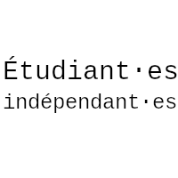
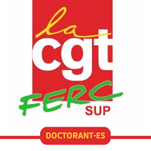

# Profession de foi

- 👉 [Profession de foi](assets/pdf/2022/PF_M22M_2022-2024.pdf)

<!--
- 👉 [Hauteskunduko adierazpena](assets/pdf/2022/)
- 👉 [Profession de Fe](assets/pdf/2022/)
-->

<!--
Pour en savoir plus sur nos différents axes :

- [💶 Lutte contre la précarité](assets/pdf/2022/)
- [👥 Pour un service public de qualité](assets/pdf/2022/)
- [📚 Démocratisation et accessibilité au savoir](assets/pdf/2022/)
- [🎓 Université de proximité](assets/pdf/2022/)
- [🗣️ Diversité culturelle et linguistique](assets/pdf/2022/)
- [✊ Université en lutte contre les dominations](assets/pdf/2022/)
- [🌱 Université écologique et sans conservateur](assets/pdf/2022/)
- [🥼 Pour une recherche sans précarité !](assets/pdf/2022/)

-->

Liste composée par :

<!---->

Liste soutenue par :

<!---->

<!--
# Ressources et communiquées de presse
-->
